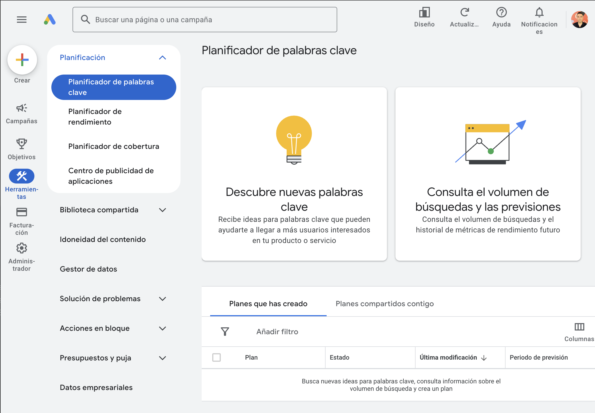
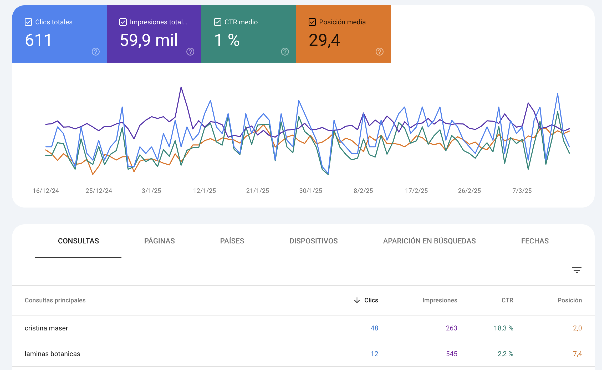

# 🔍 SEO Semántico
## Guía para Optimización Semántica

---

## 🎯 Contenido

1. 🌟 Introducción al SEO Semántico
2. 🔤 Palabras Clave
3. 📊 Análisis de Búsquedas
4. 🔎 Análisis de Competencia
5. 💡 Detectar oportunidades
6. 📈 Medir y mejorar

---

## 🌟 1. Introducción al SEO Semántico

El SEO semántico va más allá de las palabras clave tradicionales, centrándose en:

- 🧠 Entender la intención real del usuario
- 🔍 Analizar el contexto completo de las búsquedas
- 📊 Evaluar la competencia real en el mercado
- 🎯 Identificar oportunidades de contenido
- 📈 Medir y optimizar el rendimiento

---

## 🔤 2. Palabras Clave

- 📝 Identificación de términos relevantes y hacer una lista

  - Las básicas del negocio que se te puedan ocurrir
  - El autocompletado de Google
  - Usar herramientas como http://ubersuggest.org/
  - Extra: Conoce la Técnica del "Cuadro de atributos"

- 📖 Crear un documento con todas las palabras

---

## 📊 3. Análisis de Búsquedas

- Visión general con Google Trends: https://trends.google.com/trends/
- Google Adwords, planficador de palabras clave: https://ads.google.com/aw/keywordplanner/home

---

---

## 🔎 4. Análisis de Competencia

- ✍️ Revisar el contenido optimizado para determinadas palabras clave. Sería la competencia real en SEO. Escribe esto en el buscador de Google (Te devuelve el contenido optimizado para determinadas palabras clave): 

  - inurl:invitaciones-de-boda-digitales
  - intitle: invitaciones-de-boda-digitales

---

## 💡 5. Detectar oportunidades

1. 🎯 **Relación entre búsquedas y contenido optimizado**: Competencia real en SEO contrastando nivel de búsqueda
2. 🔑 **Keywords de cola larga**
3. 📝 **Contenido no cubierto**

---

## 📈 6. Medir y mejorar

- 📊 Google Search Console - Métricas Clave
  - **Impresiones** (número de veces que aparece tu sitio en resultados): Crear más contenido relevante
  - **Clics** (número de veces que la gente hace clic en tu sitio): Mejorar títulos llamativos y descriptivos, optimizar meta descripciones con llamadas a la acción, usar palabras clave en títulos, mostrar beneficios, etc.
  - **CTR** (tasa de clics = clics/impresiones): Primero mejorar las impresiones, luego ir optimizando los clicks para mejorar el CTR
  - **Posición Media** (promedio de posición en resultados): Mejorar la autoridad del sitio con enlaces de calidad, optimizar el SEO técnico: la velocidad de carga, sitemaps, marcado estructurado, responsive, mobile-first

---

---

## 🔍 Práctica: Keyword Research

Vamos a realizar un análisis de palabras clave paso a paso:

1. **Búsqueda inicial**

2. **Análisis de competencia**

3. **Evaluación de oportunidades**

4. **Priorización**

---

<!-- _class: lead -->
## 🎉 ¡Gracias!

